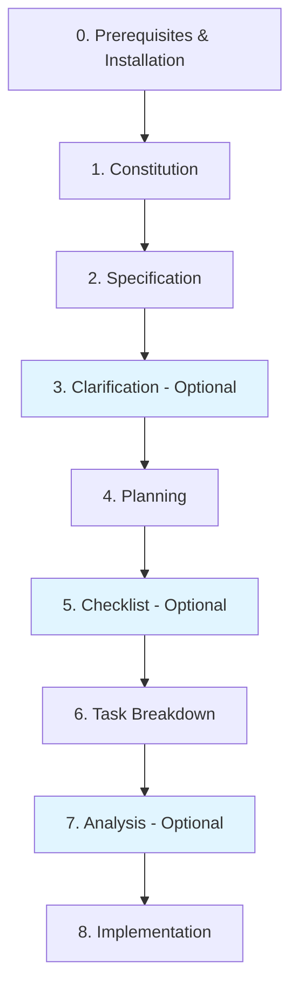
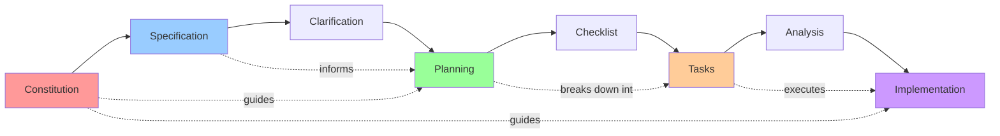

# Lab: Spec-Driven Development with Spec-Kit

**Audience:** Build with Bob · **Level:** Intermediate → Advanced · **Topics:** `spec-kit` · `workflow` · `planning` · `bob`

> Spec-Driven Development flips traditional software development by making specifications **executable and the source of truth**, rather than documentation that gets discarded after coding begins. It's a structured, 8-phase workflow that ensures quality through systematic planning and implementation.

---

## Tutorial Flow

1. [Overview](#overview)
2. [Prerequisites & Installation](#phase-0)
3. [Phase 1 · Constitution](#phase-1)
4. [Phase 2 · Specification](#phase-2)
5. [Phase 3 · Clarification _(optional)_](#phase-3)
6. [Phase 4 · Planning](#phase-4)
7. [Phase 5 · Checklist _(optional)_](#phase-5)
8. [Phase 6 · Task Breakdown](#phase-6)
9. [Phase 7 · Analysis _(optional)_](#phase-7)
10. [Phase 8 · Implementation](#phase-8)
11. [Key Principles](#key-principles)
12. [Best Practices](#best-practices)
13. [Example Workflow](#example-workflow)
14. [When to Use](#when-to-use)
15. [Command Reference](#command-reference)
16. [Project Structure](#project-structure)
17. [Troubleshooting](#troubleshooting)
18. [Resources](#resources)

---

## Overview

<a id="overview"></a>

### The 8-Phase Workflow



| Phase | Type | Purpose |
|---|---|---|
| 0. Prerequisites | Setup | Install tools and initialize project |
| 1. Constitution | Required | Define project principles and standards |
| 2. Specification | Required | Define WHAT to build (requirements) |
| 3. Clarification | Optional | Resolve ambiguities before planning |
| 4. Planning | Required | Define HOW to build (tech stack) |
| 5. Checklist | Optional | Validate requirements completeness |
| 6. Task Breakdown | Required | Generate actionable tasks |
| 7. Analysis | Optional | Validate coverage and consistency |
| 8. Implementation | Required | Execute tasks systematically |

### Architecture Overview



---

## Important: Understanding Slash Commands

**All `/speckit.*` commands are used in your AI coding agent's chat interface, NOT in the terminal.**

- ✅ Type them in **Bob** chat
- ❌ Do NOT run them in your terminal/command line
- ✅ Available after running `specify init` in your project
- ✅ The AI agent executes them and creates the necessary files

---

## Phase 0 · Prerequisites & Installation

<a id="phase-0"></a>

### Check Prerequisites

```bash
python3 --version  # Must be 3.11+
uv --version       # Package manager
git --version      # Version control
```

### Install `uv` (if needed)

```bash
# Linux/macOS
curl -LsSf https://astral.sh/uv/install.sh | sh

# Windows
powershell -c "irm https://astral.sh/uv/install.ps1 | iex"
```

### Install Spec-Kit CLI

`uv tool install` installs `specify-cli` **globally** in an isolated environment — no virtual environment activation needed.

```bash
# Install from main branch
uv tool install specify-cli --from git+https://github.com/github/spec-kit.git

# Verify installation
specify version
```

> **Alternative:** If you prefer `pipx`:
> ```bash
> pipx install git+https://github.com/github/spec-kit.git
> specify version
> ```

**Why NOT a virtual environment?**

| ❌ Virtual environment | ✅ `uv tool install` |
|---|---|
| Must activate every time | Available globally |
| Per-project dependency | Isolated automatically |
| Not designed for CLI tools | Built for CLI tools |

### Initialize Project

```bash
echo "y" | specify init . --ai bob
specify check
```

**What this creates:**
- `.specify/` directory structure
- Slash commands for Bob (`/speckit.*`)
- Templates for specifications, plans, and tasks
- Scripts for workflow automation

---

## Phase 1 · Constitution

<a id="phase-1"></a>

**Purpose:** Establish governing principles — coding standards, testing, architecture, error handling, naming, performance, decision rules.

**Command (in Bob chat):**
```
/speckit.constitution
```

**Example usage in Bob chat:**
```
/speckit.constitution Create principles for a personal finance tracker:
- TypeScript strict mode, no 'any', functional style preferred
- File size limit: 200 lines per file
- Minimum 80% line coverage on business logic
- Privacy-first: all data stored locally
- Clean architecture with clear separation of concerns
- Error handling: explicit error types, no silent failures
- Performance: sub-100ms response time for all operations
```

**Output:** `.specify/memory/constitution.md`

✅ Define non-negotiable standards  
✅ Establish decision-making framework  
✅ Set quality benchmarks  
✅ Guide all subsequent phases  

---

## Phase 2 · Specification

<a id="phase-2"></a>

**Purpose:** Define WHAT to build — user needs, functional requirements, user stories, edge cases, out of scope.

**Command (in Bob chat):**
```
/speckit.specify
```

**Example prompt:**
```
Build a photo album organizer that helps users organize photos into albums.

User Stories:
- As a user, I want to create albums grouped by date
- As a user, I want to drag-and-drop to reorganize albums
- As a user, I want to view photos in a tile interface within albums
- As a user, I want to search photos by date or tags

Constraints:
- Albums are never nested (flat structure only)
- Photos can belong to multiple albums
- All operations must work offline

Out of Scope:
- Photo editing capabilities
- Cloud synchronization
- Sharing albums with other users
```

**Output:** `specs/[feature-number]-[feature-name]/spec.md` + automatic branch creation

**Critical rule:**

| ✅ Include | ❌ Exclude |
|---|---|
| User stories | Technology choices |
| Functional requirements | Implementation details |
| Edge cases | Architecture decisions |
| Boundaries (out of scope) | How it will be built |

---

## Phase 3 · Clarification _(optional)_

<a id="phase-3"></a>

**Purpose:** Identify and resolve ambiguities and edge cases before planning.

**Command (in Bob chat):**
```
/speckit.clarify
```

**When to use:**
- Requirements feel vague
- Multiple interpretations exist
- Complex features with many edge cases
- Before planning to reduce rework

**What it does:**
- Analyzes the specification for ambiguities
- Asks targeted, sequential questions
- Records answers in a Clarifications section
- Updates `spec.md` with resolved details

**Example questions it might ask:**
- "What happens when a user tries to delete an album with photos?"
- "Should photos maintain their order within albums?"
- "How should the system handle duplicate photo uploads?"

**Output:** Updated `spec.md` with a clarifications section

---

## Phase 4 · Planning

<a id="phase-4"></a>

**Purpose:** Define HOW to build — tech stack, architecture, database, API design, testing, deployment.

**Command (in Bob chat):**
```
/speckit.plan
```

**Example prompt:**
```
Technical Implementation:
- Frontend: React with TypeScript, Vite build tool
- Styling: Tailwind CSS for responsive design
- State Management: Zustand for simplicity
- Database: IndexedDB for local storage
- Testing: Vitest for unit tests, Playwright for E2E
- Architecture: Clean architecture with clear layers
  - Presentation Layer (React components)
  - Application Layer (use cases)
  - Domain Layer (business logic)
  - Infrastructure Layer (storage, file access)
```

**Output files:**

| File | Contents |
|---|---|
| `plan.md` | Technical implementation plan |
| `data-model.md` | Database schema and relationships |
| `research.md` | Technology research and decisions |
| `contracts/` | API specifications (if applicable) |
| `quickstart.md` | Setup and development instructions |

---

## Phase 5 · Checklist _(optional)_

<a id="phase-5"></a>

**Purpose:** Validate requirements completeness, clarity, and consistency.

**Command (in Bob chat):**
```
/speckit.checklist
```

**When to use:** After planning, before task breakdown — especially for quality-critical projects.

**What it validates:**
- ✅ All user stories have acceptance criteria
- ✅ Edge cases are documented
- ✅ Requirements are testable
- ✅ No conflicting requirements
- ✅ Technical feasibility confirmed
- ✅ Performance requirements defined
- ✅ Security considerations addressed

**Output:** Quality validation checklist (like "unit tests for English")

---

## Phase 6 · Task Breakdown

<a id="phase-6"></a>

**Purpose:** Convert the plan into ordered, actionable tasks.

**Command (in Bob chat):**
```
/speckit.tasks
```

**Output:** `specs/[feature]/tasks.md`

**Task structure example:**
```markdown
## Phase 1: Data Model & Infrastructure
- [ ] Task 1.1: Define Album entity with properties (id, name, date, photoIds)
  - Files: `src/domain/entities/Album.ts`
  - Acceptance: Album entity with validation

- [P] Task 1.2: Implement IndexedDB repository for Albums
  - Files: `src/infrastructure/repositories/AlbumRepository.ts`
  - Acceptance: CRUD operations with error handling

## Checkpoint 1: Data Layer Validation
- [ ] Verify all entities persist correctly
- [ ] Test repository error handling
```

**Task markers:**

| Marker | Meaning |
|---|---|
| `[ ]` | Pending |
| `[x]` | Completed |
| `[P]` | Can run in parallel |
| `[-]` | In progress |

**Task ordering:**
1. Data models
2. Repositories
3. Services / Use cases
4. Components
5. Tests (TDD approach)
6. Checkpoints

---

## Phase 7 · Analysis _(optional)_

<a id="phase-7"></a>

**Purpose:** Cross-artifact consistency check before implementation begins.

**Command (in Bob chat):**
```
/speckit.analyze
```

**What it validates:**

| Check | Description |
|---|---|
| ✅ Spec Coverage | All requirements have corresponding tasks |
| ✅ Data Model Completeness | All entities and relationships defined |
| ✅ Plan Alignment | Plan follows constitution principles |
| ✅ Test Coverage | Tests exist for all business logic |
| ✅ Constitution Compliance | Implementation matches standards |
| ✅ Dependency Order | Tasks respect dependencies |

**Output:** Analysis report with ✅ / ⚠️ / ❌ items

> Fix all ❌ issues before moving to implementation. Address ⚠️ warnings if critical.

---

## Phase 8 · Implementation

<a id="phase-8"></a>

**Purpose:** Execute tasks systematically from `tasks.md`.

**Command (in Bob chat):**
```
/speckit.implement
```

**Implementation rules:**

1. **Work in order** — follow task sequence strictly and respect dependencies
2. **Pause after every 5 tasks** — review, test, get approval before continuing
3. **Write complete code** — production-ready, not pseudocode; include error handling
4. **Check off tasks** — mark `[x]` in `tasks.md` as you go
5. **Create stubs for dependencies** — document and replace with real implementation later
6. **Validate checkpoints** — test at each checkpoint before proceeding

**Progress tracking example:**
```markdown
## Phase 1: Data Model & Infrastructure
- [x] Task 1.1: Define Album entity ✓
- [x] Task 1.2: Implement AlbumRepository ✓

## Checkpoint 1: Data Layer Validation ✓
- [x] All entities persist correctly
- [x] Repository error handling tested

## Phase 2: Core Business Logic (IN PROGRESS)
- [x] Task 2.1: CreateAlbum use case ✓
- [-] Task 2.2: AddPhotoToAlbum use case (in progress)
- [ ] Task 2.3: RemovePhotoFromAlbum use case
```

---

## Key Principles

<a id="key-principles"></a>

### Separation of Concerns

| Phase | Focus | Avoid |
|---|---|---|
| **Specification** | WHAT to build | HOW to build it |
| **Planning** | HOW to build | Actual implementation |
| **Implementation** | Building it | Changing requirements |

### Traceability

```
Constitution → Guides → Planning
     ↓                      ↓
Specification → Informs → Tasks → Executes → Implementation
```

Every decision is documented, traceable to requirements, aligned with the constitution, and validated at checkpoints.

### User Control — Mandatory Confirmation Rule

For **every** `/speckit.*` command:
1. Present the command with pre-filled data
2. Explain what it will create/do
3. Ask: *"Would you like me to proceed, or modify anything?"*
4. **Wait for explicit approval**
5. Execute only after confirmation

> ❌ Never execute without approval  
> ❌ Never assume the user wants to proceed  
> ❌ Never run spec commands in the terminal

---

## Best Practices

<a id="best-practices"></a>

### ✅ Do

- **Create constitution before specification** — establishes standards first, prevents rework
- **Use clarification to resolve ambiguities** — catches edge cases before planning
- **Run analysis before implementation** — validates consistency, prevents missing requirements
- **Test incrementally** — after each task and at every checkpoint
- **Follow command sequence strictly** — each phase builds on the previous

### ❌ Don't

- **Skip the constitution** — leads to inconsistent decisions and no quality standards
- **Mix WHAT and HOW in specifications** — keep requirements and tech decisions separate
- **Assume command execution without approval** — always wait for confirmation
- **Write pseudocode** — write production-ready code with error handling
- **Proceed with ❌ issues from analysis** — fix critical issues first

---

## Example Workflow

<a id="example-workflow"></a>

The following shows a complete Spec-Kit run for a **team task manager** (Taskify).

### 1 · Constitution
```
/speckit.constitution

Create principles for a team task manager:
- TypeScript strict mode, no 'any' types
- React with functional components only
- 80% minimum test coverage
- Mobile-first responsive design
- Accessibility: WCAG 2.1 AA compliance
- Performance: < 100ms UI response time
```

### 2 · Specification
```
/speckit.specify

Build Taskify, a team productivity platform.

User Stories:
- As a team member, I want to create projects to organize work
- As a team member, I want to add tasks with descriptions
- As a team member, I want to assign tasks to team members
- As a team member, I want to move tasks between Kanban columns
- As a team member, I want to comment on tasks for collaboration

Out of Scope:
- User registration / authentication
- Email notifications
- File attachments
- Time tracking
```

### 3 · Clarification _(optional)_
```
/speckit.clarify
# System asks: "Should tasks have due dates?"
# System asks: "What happens to comments when a task is deleted?"
```

### 4 · Planning
```
/speckit.plan

Frontend: React 18 + TypeScript, Vite
State: Zustand
Styling: Tailwind CSS
Backend: Supabase (PostgreSQL + real-time)
Testing: Vitest + React Testing Library + Playwright
Deployment: Vercel
Architecture: Clean Architecture (domain / application / infrastructure / presentation)
```

### 5–7 · Checklist, Tasks, Analysis
```
/speckit.checklist   # Validate completeness
/speckit.tasks       # Generate ordered task list
/speckit.analyze     # Cross-check consistency
```

### 8 · Implementation
```
/speckit.implement
# Executes tasks in order, pauses every 5 tasks for review
```

---

## When to Use

<a id="when-to-use"></a>

### ✅ Ideal for

| Scenario | Why it works |
|---|---|
| Greenfield projects | Start with proper foundations and architecture |
| Brownfield development | Add features systematically while maintaining consistency |
| Complex features | Break down complexity through structured planning |
| Team collaboration | Shared understanding through documented specs |
| Quality-critical apps | High reliability through systematic validation |
| Enterprise applications | Traceability for compliance and audit requirements |

### ❌ Not ideal for

| Scenario | Why it's overkill |
|---|---|
| Quick prototypes | Too much overhead for throwaway code |
| Trivial scripts | One-file utilities don't need the full workflow |
| Emergency hotfixes | Time-critical fixes need speed |
| Proof of concepts | Discovery phase needs rapid iteration |

---

## Command Reference

<a id="command-reference"></a>

### Installation (terminal)

```bash
# Install uv
curl -LsSf https://astral.sh/uv/install.sh | sh

# Install spec-kit
uv tool install specify-cli --from git+https://github.com/github/spec-kit.git

# Verify
specify version

# Initialize project
specify init . --ai bob
specify check
```

### Workflow (Bob chat, in order)

```
/speckit.constitution   # 1. Project principles    (REQUIRED)
/speckit.specify        # 2. Requirements           (REQUIRED)
/speckit.clarify        # 3. Resolve ambiguities    (OPTIONAL)
/speckit.plan           # 4. Technical design       (REQUIRED)
/speckit.checklist      # 5. Quality checklist      (OPTIONAL)
/speckit.tasks          # 6. Task breakdown         (REQUIRED)
/speckit.analyze        # 7. Validate coverage      (OPTIONAL)
/speckit.implement      # 8. Execute implementation (REQUIRED)
```

### Additional commands

```bash
# Convert tasks to GitHub issues
/speckit.taskstoissues

# Extensions
specify extension search
specify extension add <name>

# Presets
specify preset search
specify preset add <name>
```

---

## Project Structure

<a id="project-structure"></a>

After initialization, your project will have:

```
project-root/
├── .specify/
│   ├── memory/
│   │   └── constitution.md          # Project principles
│   ├── scripts/
│   │   └── bash/
│   │       ├── check-prerequisites.sh
│   │       ├── create-new-feature.sh
│   │       ├── setup-plan.sh
│   │       └── setup-tasks.sh
│   ├── templates/
│   │   ├── spec-template.md
│   │   ├── plan-template.md
│   │   └── tasks-template.md
│   ├── extensions/
│   └── presets/
├── specs/
│   └── 001-feature-name/
│       ├── spec.md                  # Feature specification
│       ├── plan.md                  # Technical plan
│       ├── data-model.md            # Database schema
│       ├── research.md              # Technology research
│       ├── tasks.md                 # Task breakdown
│       ├── quickstart.md            # Setup instructions
│       └── contracts/
│           └── api-spec.json
└── src/                             # Created during implementation
```

---

## Troubleshooting

<a id="troubleshooting"></a>

| Problem | Solution |
|---|---|
| `uv` not found | `curl -LsSf https://astral.sh/uv/install.sh \| sh` then restart terminal |
| Python version too old | Install Python 3.11+ from [python.org](https://python.org) or via `pyenv` |
| `specify` command not found | Add `export PATH="$HOME/.local/bin:$PATH"` to `~/.bashrc` and `source ~/.bashrc` |
| Specification too vague | Run `/speckit.clarify` and add more detail to user stories; define what is out of scope |
| Plan doesn't match constitution | Explicitly reference constitution principles in your planning prompt |
| Tasks missing requirements | Run `/speckit.analyze`, fix identified gaps, ensure every requirement maps to a task |
| Implementation errors | Check browser console, verify dependencies, run tests after each task, validate checkpoints |

---

## Resources

<a id="resources"></a>

| Resource | Link |
|---|---|
| GitHub Repository | https://github.com/github/spec-kit |
| Documentation | https://github.github.io/spec-kit/ |
| Video Overview | https://www.youtube.com/watch?v=a9eR1xsfvHg |
| Installation Guide | https://github.github.io/spec-kit/installation.html |
| CLI Reference | https://github.github.io/spec-kit/reference/overview.html |
| Community Extensions | https://github.github.io/spec-kit/community/extensions.html |
| Community Walkthroughs | https://github.github.io/spec-kit/community/walkthroughs.html |

---

**[Back to Bob Bootcamp](../README.md)**
